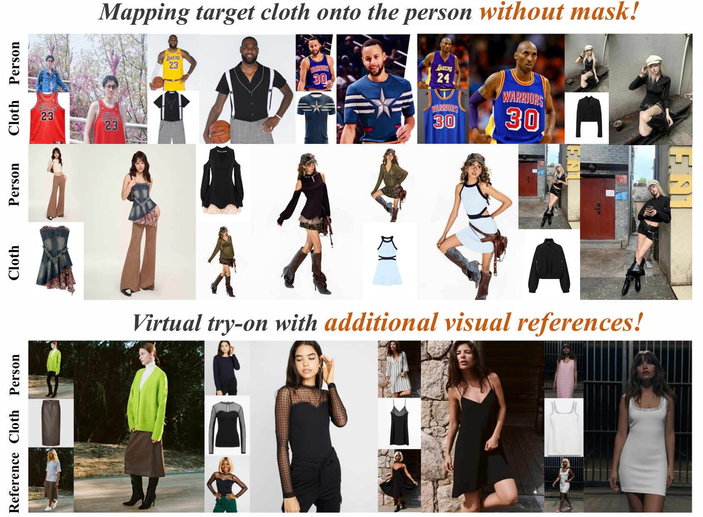

# RefTon: Reference person shot assist virtual Try-on (CVPR 2026)

[](https://huggingface.co/qihoo360/RefVTON) [](https://arxiv.org/abs/2511.00956)




`RefTon` is a FLUX-Kontext-based virtual try-on framework that conditions on the target garment together with an optional reference person image. The core idea is simple: a flat garment image alone often misses important wearing cues such as drape, texture response, translucency, and how details look on a real body. By adding a reference image of another person wearing the same garment, `RefTon` preserves garment identity more faithfully and produces more stable try-on results in both benchmark and in-the-wild scenarios.

## 💡 Updates
- [2025.10.11] Release inference code and LoRA weights on [Hugging Face](https://huggingface.co/qihoo360/RefVTON).
- [2025.10.13] Release the technical report on [arXiv](https://arxiv.org/abs/2511.00956).
- [2025.2.21] **Our RefTon is accepted by CVPR 2026 🎉🎉🎉**
- [2026.3.28] Release the training code and [VRF datasets](https://huggingface.co/qihoo360).

## 💪 Why RefTon

### 1. Better garment fidelity through additional visual reference
Compared with garment-only conditioning, the extra reference image supplies appearance cues that are hard to infer from a shop image alone. This is especially useful for recovering fabric texture, fine patterns, wearing shape, and other detail-sensitive regions.

### 2. One model, multiple conditioning modes
This `RefTon` codebase supports both masked try-on and direct person-based try-on:
- agnostic image + cloth image
- person image + cloth image
- either mode with or without a reference image

This makes the model usable for paired, unpaired, and custom in-the-wild inputs without changing the training code.

## 🧩 Environment Setup

```bash
conda create -n RefTon python=3.12 -y
conda activate RefTon
pip install -r requirements.txt
```

This repository uses the official pip version of `diffusers` and expects `diffusers>=0.35.0`.

If this is your first time using `accelerate`, run:

```bash
accelerate config
```

## 📂 Data and Pretrained Model Preparation

### Supported inputs
The code automatically chooses the dataset loader from `--instance_data_dir`:
- paths containing `viton` use the VITON-HD loader
- paths containing `DressCode` use the DressCode loader
- other paths use the custom in-the-wild loader

### Pretrained backbone
Download [FLUX.1-Kontext-dev](https://huggingface.co/black-forest-labs/FLUX.1-Kontext-dev) and pass its local path through `--pretrained_model_name_or_path`.

### LoRA weights
For inference, `--output_dir` is the LoRA weight path to load. It can be a `.safetensors` file or a checkpoint directory supported by `diffusers`. Our released LoRA weights are available in the [RefTon Hugging Face repository](https://huggingface.co/qihoo360/RefVTON).

### Custom folder layout
For custom inference, the repository expects a directory layout like:

```text
example/
├── agnostic/
├── cloth/
├── image_ref/
├── images/
└── person/
```

Notes:
- `cloth/` garment images, is always required.
- `agnostic/` target garment agnost images, is required when you do not use `--use_person`.
- `person/` target person wearing different garment, is required when you use `--use_person`.
- `image_ref/` target cloth worn by different person, is required when you use `--use_reference`.
- `images/` is optional for custom inference, but useful for visualization or future evaluation.


One of the main advantages of `RefTon` is the use of a person image showing the target person wearing a different garment, together with a reference image showing the target garment on another body. Public try-on datasets such as VITON-HD and DressCode do not provide this signal by default, so we supplement these benchmarks with our generated person and reference images. You can download our `VRF` data from [Hugging Face](https://huggingface.co/qihoo360).

For the [DressCode](https://github.com/aimagelab/dress-code) dataset, we currently provide only the processed images, such as refined agnostic, person, and reference images. Due to copyright restrictions, the original dataset is not redistributed in this repository. For the [VITON-HD](https://github.com/shadow2496/VITON-HD), [IGPairs](https://huggingface.co/datasets/IMAGDressing/IGPair), [ViViD](https://becauseimbatman0.github.io/ViViD), and [FashionTryon](https://fashiontryon.wixsite.com/fashiontryon) datasets, we provide only the necessary subsets, such as target, cloth, and agnostic images, and remove unused annotations such as masks and DensePose files. For the [DressCode](https://github.com/aimagelab/dress-code) dataset, we provide only the processed subsets, such as person, reference, and refined agnostic images, and exclude the unprocessed subsets, including cloth, target, mask, and others. Please obtain the original data from the official dataset sources listed in the acknowledgement section.

Please download the pretrained LoRA weights for inference from [](https://huggingface.co/qihoo360/RefVTON).


## 🚀 Training
The training entrypoint is `train_refton_lora.py`.

Below is the training command corresponding to the attached script:

```bash
CUDA_VISIBLE_DEVICES=0,1,2,3,4,5,6,7 accelerate launch --num_processes 8 --main_process_port 29501 train_refton_lora.py \
  --pretrained_model_name_or_path your_FLUX.1-Kontext-dev_model_path \
  --instance_data_dir your_data_path \
  --split train \
  --output_dir checkpoints \
  --mixed_precision bf16 \
  --height 512 \
  --width 384 \
  --train_batch_size 8 \
  --guidance_scale 1 \
  --gradient_checkpointing \
  --optimizer adamw \
  --rank 64 \
  --lora_alpha 128 \
  --use_8bit_adam \
  --learning_rate 1e-4 \
  --lr_scheduler constant \
  --lr_warmup_steps 0 \
  --num_train_epochs 64 \
  --cond_scale 2.0 \
  --seed 0 \
  --dropout_reference 0.5 \
  --person_prob 0.5
```

Key arguments:
- `--pretrained_model_name_or_path`: local path to the FLUX-Kontext backbone.
- `--instance_data_dir`: dataset root. Use a path containing `viton` or `DressCode` for the built-in loaders.
- `--output_dir`: directory used to save checkpoints and exported LoRA weights.
- `--rank` and `--lora_alpha`: LoRA capacity settings.
- `--cond_scale`: spatial scaling for conditioning inputs. In the provided setup, we recommend using `1.0` for `512x384` and `2.0` for `1024x768`.
- `--dropout_reference`: probability of dropping the reference branch during training.
- `--person_prob`: probability of using the full person image instead of the agnostic image during training.

Practical notes:
- The provided command trains at `512x384`.
- To train at `1024x768`, set `--height 1024 --width 768` and keep `--cond_scale 2`.
- If GPU memory is limited, reduce `--train_batch_size`, keep `--gradient_checkpointing`, and lower the number of processes.

## ⏳ Inference
Below is the inference command corresponding to the attached script:

```bash
CUDA_VISIBLE_DEVICES=0,1,2,3,4,5,6,7 accelerate launch --num_processes 8 --main_process_port 29502 inference.py \
  --pretrained_model_name_or_path your_FLUX.1-Kontext-dev_model_path \
  --instance_data_dir example \
  --output_dir checkpoints/512_384_pytorch_lora_weights.safetensors \
  --mixed_precision bf16 \
  --split test \
  --height 512 \
  --width 384 \
  --inference_batch_size 1 \
  --cond_scale 1.0 \
  --seed 0 \
  --use_reference \
  --use_person \
  # --use_different
```

Recommend using `cond_scale=1.0` for `512x384` inference and `2.0` for `1024x768` inference. `--use_different` is optional and is mainly used for evaluation in unpaired settings.

What each flag does:
- `--output_dir`: path to the LoRA weights to load during inference.
- `--use_reference`: enables the reference person image branch.
- `--use_person`: uses the full person image as the try-on base.
- `--use_different`: uses unpaired cloth-person combinations. This is mainly for VITON-HD and DressCode evaluation. Default: false.

Output locations:
- Results are saved under `<instance_data_dir>/sample_*`.
- The folder name depends on the input mode, for example `sample_person`, `sample_person_ref`, `sample_person_unpair`, or `sample_person_unpair_ref`.
- For DressCode, category-wise outputs are also merged into an `all/` subfolder automatically.

Recommended usage patterns:
- garment + agnostic: do not pass `--use_person`
- garment + person: pass `--use_person`
- add reference image support: pass `--use_reference`

## 📊 Evaluation
The repository provides evaluation scripts for FID, KID, SSIM, and LPIPS.

### VITON-HD

```bash
CUDA_VISIBLE_DEVICES=0 python evaluation/eval.py \
  --gt_folder path_to_ground_truth_images \
  --pred_folder path_to_generated_images \
  --paired
```

### DressCode

```bash
CUDA_VISIBLE_DEVICES=0 python evaluation/eval_dresscode.py \
  --gt_folder_base path_to_dresscode_ground_truth_root \
  --pred_folder_base path_to_generated_result_root \
  --paired
```

Notes:
- Use `--paired` only for paired evaluation, where SSIM and LPIPS are meaningful.
- For unpaired evaluation, omit `--paired` and report FID and KID.

Evaluation results on the VITON-HD and DressCode datasets:


Evaluation results on the three DressCode subsets:


## 🌸 Acknowledgement
This codebase is built on top of [diffusers](https://github.com/huggingface/diffusers/tree/main), [FLUX](https://github.com/huggingface/diffusers/tree/main/src/diffusers/pipelines/flux), and [CatVTON](https://github.com/Zheng-Chong/CatVTON/), and the dataset construction also builds on [VITON-HD](https://github.com/shadow2496/VITON-HD), [DressCode](https://github.com/aimagelab/dress-code), [IGPairs](https://huggingface.co/datasets/IMAGDressing/IGPair), [ViViD](https://becauseimbatman0.github.io/ViViD), and [FashionTryon](https://fashiontryon.wixsite.com/fashiontryon). We sincerely appreciate their contributions to the virtual try-on community!

## 💖 Citation
If you find this repository useful, please consider citing our paper: [](https://arxiv.org/abs/2511.00956).